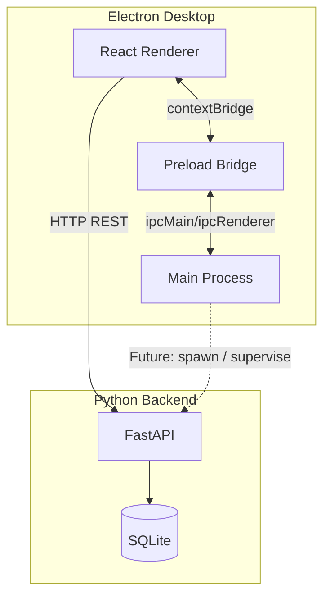

# Orbit Architecture

## Goals

Orbit is designed as a **modular desktop platform** where AI copilot, semantic search, document intelligence, monitoring, automation, and analytics plug into stable boundaries—not ad hoc imports across the UI and main process.

## High-level topology



## Process responsibilities

| Layer | Responsibility |
|-------|----------------|
| **Renderer (`frontend/`)** | UX, routing, client state, calling API + IPC |
| **Preload (`electron/preload/`)** | Minimal, typed surface exposed to renderer |
| **Main (`electron/main/`)** | Windowing, OS integration, privileged IPC handlers |
| **Backend (`backend/`)** | Persistent data, AI/search services (Phase 2+), health |
| **Shared (`shared/`)** | IPC contracts and cross-cutting TypeScript types |

## Security model (Electron)

- `contextIsolation: true`, `nodeIntegration: false`, `sandbox: true`
- Only whitelisted channels in `shared/types` are invoked from the renderer
- External links open via `shell.openExternal`
- CSP on `index.html` restricts script and connect sources

## Frontend structure

- **Feature-ready routing** via hash router (file:// compatible in packaged builds)
- **Zustand** for theme + chrome UI state (persisted)
- **TanStack Query** for server/IPC status and future API modules
- **Layouts** encapsulate shell; **pages** remain thin entry points

## Backend structure

```
backend/app/
├── api/routes/      # HTTP adapters
├── services/        # Domain logic (empty in Phase 1)
├── models/          # SQLAlchemy tables
├── database/        # Engine, sessions, init
├── middleware/      # Request context, future auth
└── core/            # Settings, logging
```

Placeholder entities (created on startup):

- `app_settings`, `indexed_files`, `ai_conversations`, `historical_metrics`, `automation_history`, `notifications`

## IPC roadmap

| Channel | Phase | Purpose |
|---------|-------|---------|
| `orbit:ping` | 1 | Connectivity check |
| `orbit:get-app-info` | 1 | Diagnostics |
| `orbit:fs:*` | 2 | Sandboxed filesystem access |
| `orbit:index:*` | 2 | Folder scans & task control |
| `orbit:watcher:resync` | 2 | Reload OS file watchers |
| `orbit:ai:invoke` | 2+ | Local/cloud model routing |
| `orbit:monitor:*` | 2+ | System metrics stream |
| `orbit:automation:run` | 2+ | Workflow execution |

## Future integration (no refactor required)

1. **AI Copilot** — `backend/app/services/ai/` + optional IPC for local inference; conversations table already exists.
2. **Semantic search** — indexing service writing to `indexed_files`; search API under `/api/v1/search`.
3. **Documents** — ingestion pipelines + document service; reuse SQLite metadata JSON columns.
4. **Monitoring** — main process collectors → IPC stream → `historical_metrics` persistence.
5. **Automation** — workflow engine in backend + `automation_history` audit trail; IPC triggers from UI.

## Configuration

- Root `.env` / `.env.example` for API host, port, database URL, log level
- Vite `VITE_API_BASE_URL` for renderer API client

## Build & delivery

- **electron-vite** compiles main, preload, and renderer to `out/`
- **electron-builder** packages `out/` into platform installers under `release/`
